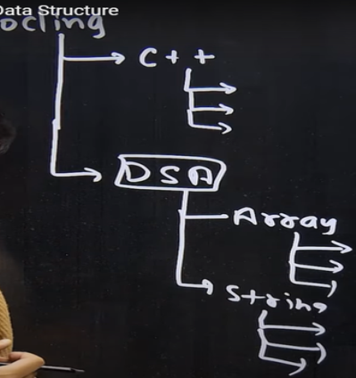
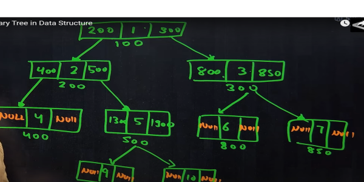
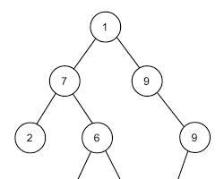

# Tree

It is a type of Data Structure that represent a hierarchial relationship between data elements called nodes.  

## Binary Tree

It is defined as a tree Data Structure where each node has atmost 2 children

## Understanding Terminologies of Trees

