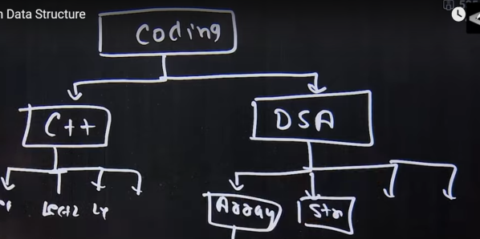
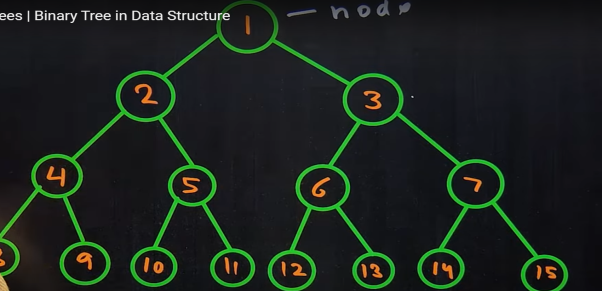

# Tree

It is a type of Data Structure that represent a hierarchial relationship between data elements called nodes.  




## Binary Tree

It is defined as a tree Data Structure where each node has atmost 2 children



## Understanding Terminologies of Trees
 

### 1. **Node**  
   - A **node** is the fundamental unit of a tree. It contains data and may have references (or pointers) to its child nodes.  
   - Example: In a binary tree, a node can have up to two children.

### 2. **Root**  
   - The **root** is the topmost node of a tree.  
   - It is the only node that does not have a parent.  
   - Example: In a family tree, the oldest known ancestor is the root.

### 3. **Parent**  
   - A **parent** node is one that has one or more child nodes.  
   - Every node (except the root) has exactly one parent.  
   - Example: In a binary tree, if node A has children B and C, then A is the parent of B and C.

### 4. **Child**  
   - A **child** node is a node that has a parent.  
   - It can have its own children (if it’s not a leaf node).  
   - Example: If node A is the parent of node B, then B is the child of A.

### 5. **Leaf**  
   - A **leaf** node is a node that has no children.  
   - It is an endpoint in the tree.  
   - Example: In an organizational chart, employees with no subordinates are leaf nodes.

### 6. **Ancestor**  
   - An **ancestor** of a node is any node that appears above it in the path to the root.  
   - Example: In a family tree, a grandparent and great-grandparent are ancestors.

### 7. **Descendant**  
   - A **descendant** of a node is any node that appears below it in the tree.  
   - Example: A person's children, grandchildren, and great-grandchildren are all descendants.

### 8. **Level**  
   - The **level** of a node represents its depth in the tree.  
   - The **root node is at level 0**, its children are at level 1, their children at level 2, and so on.  
   - Formula: **Level of a node = (Depth of the node)**  

### 9. **Sibling**  
   - **Siblings** are nodes that share the same parent.  
   - Example: In a binary tree, if A is the parent of B and C, then B and C are siblings.

### 10. **Height**  
   - The **height** of a tree is the number of edges on the longest path from the root to a leaf.  
   - **Height of a node** = Number of edges in the longest path from that node to a leaf.  
   - Example: If the longest path from the root to a leaf contains 4 edges, the tree's height is 4.

### 11. **Degree**  
   - The **degree of a node** is the number of its children.  
   - The **degree of a tree** is the maximum degree of any node in the tree.  
   - Example: In a binary tree, the degree of any node is at most 2.

### 12. **Edges**  
   - An **edge** is the connection between two nodes.  
   - A tree with **N nodes has (N-1) edges** because every node (except the root) has exactly one incoming edge.  


Here’s a visual representation of a **Tree Data Structure** illustrating all the concepts:  

```
        A  (Root, Level 0)
       / \
      B   C  (Parent: A, Siblings: B & C, Level 1)
     / \   \
    D   E   F  (Parents: B & C, Level 2)
   / \
  G   H   (Parent: D, Siblings: G & H, Leaf Nodes, Level 3)
```

### Explanation:
1. **Node**: Each letter represents a node (A, B, C, D, E, F, G, H).
2. **Root**: A is the root (topmost node).
3. **Parent**: B is the parent of D and E; C is the parent of F.
4. **Child**: D and E are children of B; F is a child of C.
5. **Leaf**: G, H, E, and F have no children, so they are leaf nodes.
6. **Ancestor**: A is an ancestor of B, C, D, E, F, G, and H.
7. **Descendant**: D, E, F, G, and H are descendants of A.
8. **Level**: A is at level 0, B & C at level 1, D, E, & F at level 2, G & H at level 3.
9. **Sibling**: B and C are siblings; D and E are siblings; G and H are siblings.
10. **Height**: The longest path from A to a leaf (A → B → D → G) has **3 edges**, so the height of the tree is **3**.
11. **Degree**: 
    - Degree of A = 2 (B, C)
    - Degree of B = 2 (D, E)
    - Degree of C = 1 (F)
    - Degree of D = 2 (G, H)
    - Degree of leaf nodes (E, F, G, H) = 0
    - Maximum degree = **2** (Binary Tree)
12. **Edges**: The tree has **7 edges** (A→B, A→C, B→D, B→E, C→F, D→G, D→H).

## How to Create Binary Tree Data structure

### **Understanding the Memory Perspective**
A **binary tree** is a hierarchical data structure where each **node** has:
1. **Data** (or value)
2. A pointer to the **left child**
3. A pointer to the **right child**

Each **node** in memory holds:
- A value (which takes up memory depending on its type, e.g., `number` or `string`).
- Two references (pointers) to child nodes (left and right), which are memory addresses.

---

### **Memory Representation**
If you imagine memory as a linked structure:
```
         [10]   <-- Root Node (stored at memory location, say 0x100)
        /    \
    [5]      [15]  <-- Each node has left & right pointers
   /   \     /   \
 [2]   [7] [12]  [20]
```
Each node has:
- A memory slot for the **value** (`number`).
- Two memory slots for the **left and right pointers** (memory addresses).

---

### **Binary Tree Implementation in JavaScript**
```javascript
// Step 1: Define the Node structure
class TreeNode {
    constructor(value) {
        this.value = value;   // Stores the value
        this.left = null;     // Pointer to left child
        this.right = null;    // Pointer to right child
    }
}

// Step 2: Define the Binary Tree class
class BinaryTree {
    constructor() {
        this.root = null;  // Initially, the tree is empty
    }

    // Step 3: Insert a new node
    insert(value) {
        const newNode = new TreeNode(value);

        if (this.root === null) {
            this.root = newNode; // If empty, set root
            return;
        }

        let current = this.root;
        while (true) {
            if (value < current.value) {
                // Go left
                if (current.left === null) {
                    current.left = newNode;
                    return;
                }
                current = current.left;
            } else {
                // Go right
                if (current.right === null) {
                    current.right = newNode;
                    return;
                }
                current = current.right;
            }
        }
    }

    // Step 4: Search for a value
    search(value) {
        let current = this.root;
        while (current !== null) {
            if (value === current.value) return true;
            current = value < current.value ? current.left : current.right;
        }
        return false;
    }

    // Step 5: In-order Traversal (Left, Root, Right)
    inOrderTraversal(node = this.root) {
        if (node !== null) {
            this.inOrderTraversal(node.left);
            console.log(node.value);
            this.inOrderTraversal(node.right);
        }
    }
}

// Usage Example
const tree = new BinaryTree();
tree.insert(10);
tree.insert(5);
tree.insert(15);
tree.insert(2);
tree.insert(7);
tree.insert(12);
tree.insert(20);

console.log("Searching for 7:", tree.search(7)); // true
console.log("Searching for 50:", tree.search(50)); // false

console.log("In-order Traversal:");
tree.inOrderTraversal(); // Output: 2 5 7 10 12 15 20
```

---

### **How This Works in Memory**
1. **When `new TreeNode(value)` is created**, it allocates memory for:
   - The value (primitive type)
   - Two memory references for left and right children

2. **When `insert()` is called**, the tree follows **pointer references** to decide where to store the new node.

3. **When `search()` is called**, it **traverses memory references** until it finds the value or reaches `null`.

---

### **Memory Complexity**
- **Each node takes up O(1) space** (constant memory).
- **Total space complexity = O(n)** (since each node requires memory for its value and two pointers).
- **Search and Insert take O(log n) on average**, but **O(n) in worst case** (if the tree is skewed).

---

### **Key Takeaways**
- Each **TreeNode** is an **object in memory** with a value and two pointers.
- The **BinaryTree** class manages the root and inserts nodes dynamically.
- Traversal methods navigate **memory pointers** from one node to another.


## How to code binary Tree Data Structure?

### **Iterative Binary Tree Code Explanation**

1. **Node Class**:  
   This part remains the same.  
   Each node has a value (`data`), a `left` pointer, and a `right` pointer.

   ```javascript
   class Node {
     constructor(data) {
       this.data = data;
       this.left = null;
       this.right = null;
     }
   }
   ```

2. **Binary Tree Class (with Iterative Insertion and Traversal)**:

   ```javascript
   class BinaryTree {
     constructor() {
       this.root = null;
     }

     // Insert a new node iteratively
     insert(data) {
       const newNode = new Node(data);

       // If the tree is empty, make the new node the root
       if (this.root === null) {
         this.root = newNode;
         return;
       }

       // Start from the root and traverse down the tree
       let currentNode = this.root;

       while (true) {
         if (data < currentNode.data) {
           // Move left
           if (currentNode.left === null) {
             currentNode.left = newNode;
             break; // Exit the loop after inserting
           }
           currentNode = currentNode.left; // Continue moving left
         } else {
           // Move right
           if (currentNode.right === null) {
             currentNode.right = newNode;
             break; // Exit the loop after inserting
           }
           currentNode = currentNode.right; // Continue moving right
         }
       }
     }

     // In-Order Traversal (Iterative using a stack)
     inOrderTraversal() {
       if (this.root === null) return;

       const stack = [];
       let currentNode = this.root;

       while (stack.length > 0 || currentNode !== null) {
         // Reach the leftmost node
         while (currentNode !== null) {
           stack.push(currentNode);
           currentNode = currentNode.left;
         }

         // Process the node on top of the stack
         currentNode = stack.pop();
         console.log(currentNode.data); // Visit the node

         // Move to the right subtree
         currentNode = currentNode.right;
       }
     }
   }

   // Test the Binary Tree
   const myTree = new BinaryTree();
   myTree.insert(15);
   myTree.insert(10);
   myTree.insert(20);
   myTree.insert(8);
   myTree.insert(12);
   myTree.insert(17);
   myTree.insert(25);

   console.log("In-Order Traversal (Iterative):");
   myTree.inOrderTraversal(); // Should print: 8, 10, 12, 15, 17, 20, 25
   ```

---

### **Explanation**

1. **Insertion (Iterative)**  
   - Start at the root and compare the value with the current node.
   - If the value is smaller, move to the left child.  
   - If it’s larger, move to the right child.
   - Continue moving until an empty spot is found, and insert the new node there.

2. **In-Order Traversal (Iterative Using a Stack)**  
   - Use a stack to simulate recursion:
     - Push all left nodes onto the stack.
     - Pop from the stack and visit the node.
     - Move to the right subtree and repeat.
   - This simulates the recursive "left → root → right" behavior without actually using recursion.

---

### **Why Iterative?**  
1. **No Stack Overflow**: Recursive functions may cause a stack overflow if the tree is deep. Iterative methods avoid this.
