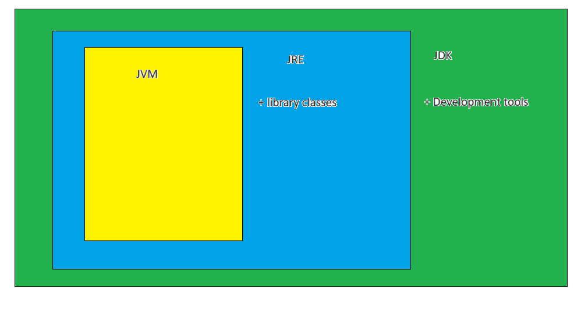

# Introduction to Java
1. It is an object oriented programming language
2. The Java platform provides a complete environment for application development  
on desktops and servers and deployment in embedded environments.
3. Java was developed by James Gosling in 1995, at Sun Microsystems which was  
later acquired by Oracle in 2010.
4. It was originally called OAK after an OAK tree that stood outside Gosling’s Office,  
later it was renamed “Green” and was finally renamed to “Java” inspired by Java  
Coffee, that’s why its logo looks like a cup of coffee. 

## Java Edition
We have 3 editions of Java for building a different kinds of applications
1. **Java Standard Edition (JSE)**
```
This is the core Java platform, it is a specification, which contains the core libraries to
develop standalone, networking, database, GUI, multithreaded types of applications.
In addition to the core API, the Java SE platform consists of the virtual machine,
Day1: Java Introduction 2
development tools, deployment technologies and other class libraries and toolkit
commonly used in Java application

```
2. **Java Enterprise Edition (JEE)**
```
The Java EE platform provides an API and runtime environment for developing and
running large-scale, multi-tiered, scalable, reliable, and secure network applications.
```
3. **Java Micro Edition (JME)**
```
It is a subset of Java SE, designed used for microdevices and embedded development
like mobile phones, sensors, micro-controller, TV set-top boxes etc.

```
## Features of Java
1. **Object-Oriented** - Java is object oriented, it supports all the OOPS characteristics.  
This makes java applications easy to develop and maintain, compared to structured  
programming language

2. **Portable and Platform Independent** - Java source code is compiled and  
converted into bytecode. this bytecode can run on multiple platforms i.e. Write Once  
and Run Anywhere(WORA), we can compile the java code in one Operating  
System and execute it on another Operating System.  

3. **Secure** - Java has provided an implicit component inside JVM in the form of a "Security Manager" to provide implicit security against malicious code.

4. **Robust** - Java is having a very good memory management system in the form of  
a heap memory management system.

5. **Multithreaded** - Java supports multithreading to enhance performance

## JDK or Java SDK
Java Standard Edition comes in the form of specification, and the implementation of this   
specification is the JDK software, also known as Java SDK (Java Standard Development kit).  
**This JDK is used for developing and executing Java applications.**



JDK = JRE + Development tools like java compiler, debugger, etc.  
JRE = (JVM + Predefined Library classes)

### JDK vs. JVM vs. JRE

| Aspect           | JDK (Java Development Kit) | JVM (Java Virtual Machine) | JRE (Java Runtime Environment) |
|------------------|----------------------------|----------------------------|--------------------------------|
| Definition      | Development kit for creating Java applications, including tools, libraries, and documentation. | Runtime engine for executing Java bytecode on a computer. | Environment for running Java applications, including JVM and libraries, without development tools. |
| Components      | Includes compiler, runtime, debugger, and development tools. | Executes Java bytecode, converting it into machine-specific instructions. | Includes JVM and libraries for running Java applications. |
| Usage           | Used by developers for writing, compiling, and debugging Java code. | Used by end-users to run Java applications. | Used by end-users to execute Java programs without development capabilities. |
| Example         | Developers use JDK to create and compile Java applications. | End-users use JVM to run Java applications on their systems. | End-users install JRE to run Java programs without needing development tools. |

## Basic steps to develop a Java Program:
1. Develop the Java program - Java Program developed with ".java" extension.
2. The Java compiler "Javac" translates the Java program into classes with extension .class. Class files are in byte code format.
3. The java interpreter "Java" converts the Java class byte codes into native code and executes it.

### There are two phases involved in Java application execution.
1. Compilation phase
2. Execution phase

* In the Compilation phase, IntelliJ uses the java compiler to compile our code into a  
different format called Java **byte-code**.  
This java compiler comes with the JDK software.
* This java byte-code, is platform-independent, which means it can run on the Window,  
Mac, Linux, or any Operating-system that has **JRE (Java Runtime Environment)**.  
We can also download this JRE, for various Operating-system separately.
* This JRE has a software component called JVM (Java Virtual Machine), this JVM  
takes our java byte-code and translates it to the native code for the underlying OS.

> If we are in the Window Operating-system, this JVM will convert our java byte-code to
the window Operating-system understandable native code, and if we are in the Linux
environment, then this JVM will convert our java byte-code to the Linux OS
understandable native code. with this architecture only, our java applications are
portable or platform-independent.
We can write a java program on a Window machine and can execute it in a Linux
or macOS or any other OS that have JRE.

### Important points to note
1. Some method returns some value, whereas some method doesnot return any value.  
The method which doesnot return any value we apply `void` as a return type.
2. `void` is a reserved keyword in java.
3. The method name should be proper and descriptive.
```
void calculateAge(){

}
```
4. **Every java program should have atlease one method. And that method is called the main method.  
The main method is an entry point of our java application.**
5. Whenever we execute a java program, the main function gets called and the code inside this main method gets executed.
This methods don't exist as their own, they always belong to a class.
**A class is like a container, of one or more methods.**
6. We use the class to orgainze our code in the java application.  
Every java program should have atlease one class, which contains the main method.

### Java Program
e.g.  
Main.java
```
public class Main{
    public static void main(String[] args){
        System.out.println("Hello world");
    }
}
```
1. `Class` is keyword and in Java all the classes and methods should have an access modifier.  
2. An access modifier is a special keyword that determines if other classes and methods in this program can access  
 these classes and methods.  
3. We have various access modifiers like public, private etc. Most of the time we use public access modifier.
4. So the basic structure of a java program contains a class and inside the class, we have a main method
5. To name our classes we use **P**ascal**N**aming**C**onvention(first letter of every word in uppercase)  
And to name our methods we use **c**amel**N**aming**C**onvention
6. Inside java programming, we have a concept called a package. we use the  
package to group related classes, so as our application grows, we are going to  
end up with many classes, so we should properly organize these classes inside  
different packages.  
By convention , the base package for a java project is the domain name of your company in reverse. e.g. com.geeksforgeeks  
So every class we create in java application should belong to a package  
7. All java files should have a .java extension. and every statement in the java
application should be terminated with a semicolon ;  
8. The **static** is a keyword. For now just remember the main method in our program should always be static.
9. `System.out.println("Hello World");`
Here System is a predefined java class, which belongs to java.lang package. inside  
this class, we have various members, out is a member (field) who belongs to this  
System class.
the type of this out field is the PrintStream class. this PrintStream is another  
predefined class in java. the println method belongs to this PrintStream class. 

So here we are calling or executing the println method inside our main method.
 


## Variables
type variableName = value;
```
int myNum = 5;
float myFloatNum = 5.99f;
char myLetter = 'D';
boolean myBool = true;
String myText = "Hello";
```
### Declaring multiple variables
```
int x = 5, y = 6, z = 50;
System.out.println(x + y + z);
```  

```
int x, y, z;
x = y = z = 50;
System.out.println(x + y + z);
```  

**The general rules for naming variables are:**

Names can contain letters, digits, underscores, and dollar signs  
Names must begin with a letter  
Names should start with a lowercase letter and it cannot contain whitespace  
Names can also begin with $ and _ (but we will not use it in this tutorial)  
Names are case sensitive ("myVar" and "myvar" are different variables)  
Reserved words (like Java keywords, such as int or boolean) cannot be used as names  