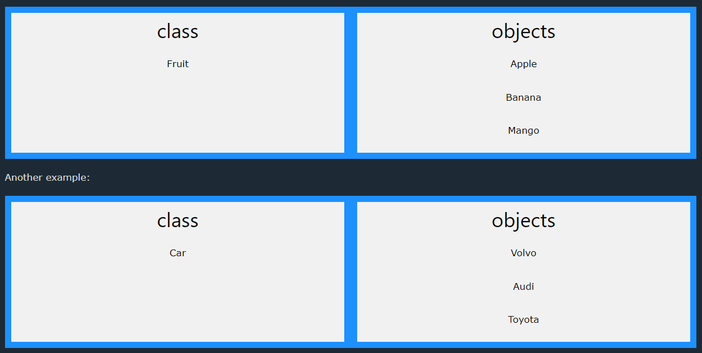

# What is OOP?
OOP stands for Object-Oriented Programming.

Procedural programming is about writing procedures or methods that perform operations on the data,  
while object-oriented programming is about creating objects that contain both data and methods.

Object-oriented programming has several advantages over procedural programming:

* OOP is faster and easier to execute
* OOP provides a clear structure for the programs
* OOP helps to keep the Java code DRY "Don't Repeat Yourself", and makes the code easier to maintain, modify and debug
* OOP makes it possible to create full reusable applications with less code and shorter development time

## Difference between Classes and Objects
Look the below image to get an idea about class and object

* A class is a template for objects, and an object is an instance of a class.
* When the individual objects are created, they inherit all the variables and methods from the class.