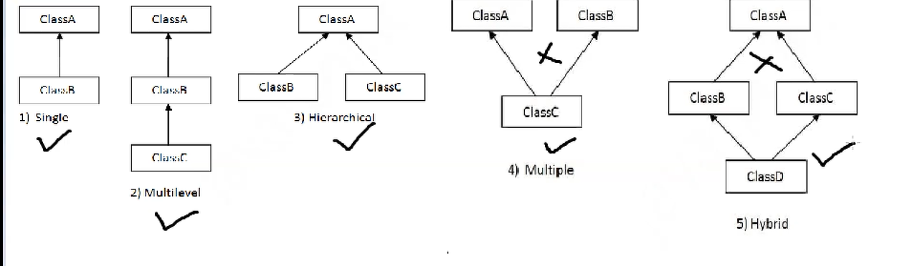

## Inheritance

Inheritance in Java is a **fundamental object-oriented programming concept** that allows one class to **inherit properties and behaviors (fields and methods)** from another class.



### 🔑 Key Points:
- **Superclass (Parent class):** The class whose features are inherited.
- **Subclass (Child class):** The class that inherits the features of another class.
- The subclass gets access to the **public** and **protected** members of the superclass.
- The keyword used for inheritance in Java is `**extends**`.

---

### 🧠 Why Use Inheritance?
- **Code reusability:** Common code can be written once in the superclass.
- **Method overriding:** Subclasses can provide specific implementations.
- **Polymorphism:** Enables dynamic method dispatch.

---

### 📌 Syntax:
```java
class Animal {
    void eat() {
        System.out.println("This animal eats food.");
    }
}

class Dog extends Animal {
    void bark() {
        System.out.println("The dog barks.");
    }
}
```

### 👇 Usage:
```java
public class TestInheritance {
    public static void main(String[] args) {
        Dog d = new Dog();
        d.eat();  // inherited method
        d.bark(); // method from Dog class
    }
}
```

### 🧱 Types of Inheritance in Java:
1. **Single Inheritance**
2. **Multilevel Inheritance**
3. **Hierarchical Inheritance**

> 🚫 **Note:** Java doesn't support **multiple inheritance with classes** (to avoid ambiguity), but you can achieve it using **interfaces**.

<!-- ______________ -->

A--parent class or super class
|
B--child or sub class

Is-A relationship

Bike is-A Vehicle
Dog Is-A Animal

* Bike is-A Vehicle
* Dog Is-A Animal

1. Code reusability
2. Runtime polymorphism
   

Example - 
Animal.java

```java
class Animal 
{
	int age;

	void eat(){
		System.out.println("I can eat");
	}
}
```

Dog.java
```java
class Dog extends Animal
{
	
	// child class can have it's own method as well
	void display(){
		System.out.println("My age is "+ age);
	}

	@Override
	void eat(){
		System.out.println("Dog can eat...");
	}
	public static void main(String[] args) 
	{
		Dog d = new Dog();
		
		d.eat();

		d.age = 2;
		d.display();
	}
}
```

## Super keyword


Animal.java
```java
class Animal 
{
	int age;
	void eat(){
		System.out.println("I can eat");
	}
}
```

Dog.java
```java
class Dog extends Animal
{

	@Override
	void eat(){
		System.out.println("Dog can eat..."); 
	}

	// child class can have it's own method as well
	void display(){
		System.out.println("My age is "+ age);
		super.eat(); // super will call the immediate parent class object
	}

	public static void main(String[] args) 
	{
		Dog d = new  Dog();
		d.display();
	}
}
```
