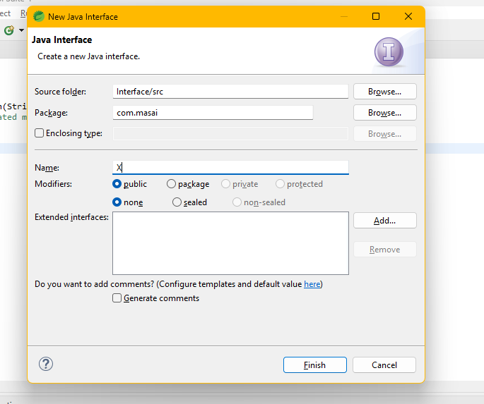
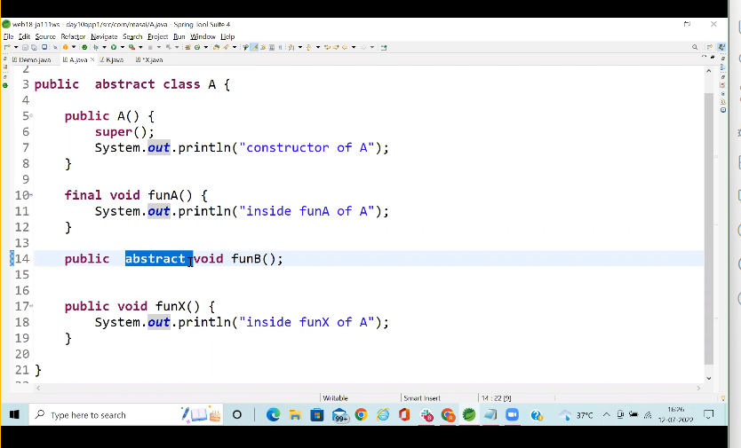
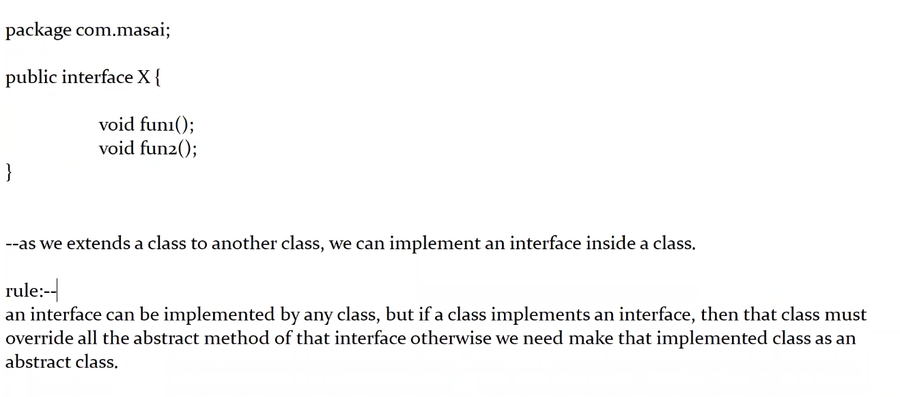
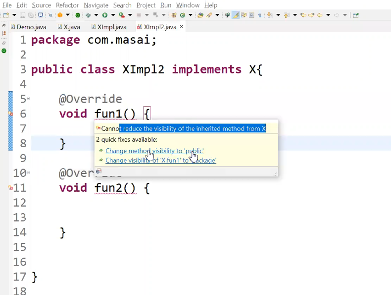

# lectures - 30927 | Notes

> Java is much more powerful than javascript
> You should start thinking how do you write logic using Java for DSA
> Start DSA with Java
> We will start collection and Exception handling in next few lectures

* **Abstract class**
  * With the help of Abstract class we achieve partial abstraction

> We have seen two concepts previously

* **Abstract class** - Object cannot be created
* **Abstract method** - Unimplemented method
* Abstract class mean to be extended.
  * > There is no meaning of abstract class until it is extended by child
  * > Abstract class existence depend upon its child class

> In Java we have 3 types of structure

1. Full implemented structure(concrete class)
2. Partial implemented structure(Abstract Class)
3. Full unimplemented structure(Interface)

> And right now we are going to discuss about the Interface first.
> What are rules regarding the interface
> What we can do and what we cannot do.
> Then what is the difference between interface and abstract class
> Where interface is used in Java
> Interface is extremely important conept in Java. You can say that it is the most important concept. Most important concept in Java is interface because in higher classes if you have hibernate, collection or your spring or any kind of other framework you will mostly see the interface. In JDBC interface only.
> By the help of interface only then you can make your application loosly coupled

## Interface

* It is **full unimplemented structure** in java
* Till JDK 1.7 interfaces use to contains only abstract methods and final variables
  * From JDK 1.8 we can place method with body also inside an interface

first we will see for JDK 1.7  
> how we create the interface



Example -  
Below is an unimplemented . 
> Inside interface you need to place only abstract method only

```java
package com.masai;

public interface X {
	
	// don't start with interface name with small letters
	// Always start with capital letters. use pascal naming convention
	
	
	public abstract void fun1();
	
}
```

save X.java and then compile  
javac X.java (if you are using notepad). after this you will get Byte code which is produced by java compiler. And it is X.class

> .class file will be generated for an interface also  
> constructor concept is not applicable with interface

Note - inside an interface if we define any unimplemented method, than that method is bydefault "public and abstract" whether we mention or not.  

e.g.  

```java
package com.masai;
public interface X{

void fun1();
// Interface के अंदर method bydefault public और Abstract होता है चाहे हम mention करें या ना करें 
// Also remember - Above facility is not present for abstract class
}


// Abstract keyword is mandatory for abstract method in abstract class




- with the help of an interface we achieve full abstraction.



Example -  

X.java  
```java
package com.masai;
public interface X{
    void fun1();
    void fun2();
}
```

- as we extends a class to another class, we can implement an interface inside a class.

**Rule -**  
an interface can be implemented by any class, but if a class implements an interface, then that class must **override all the abstract method** of that interface otherwise we need to **make that implemented class as an abstract class.**

XImpl.java  

```java
package com.masai;

public class XImpl implements X {

	@Override
	public void fun1() {
		
		System.out.println("inside fun1 of XImpl");
	}

	@Override
	public void fun2() {
		System.out.println("inside fun2 of XImpl");
	}
	
	//specific method 
	public void fun3() {
		System.out.println("inside fun3 of XImpl");
	}

}

```
Note - We can define **reference variable** of an interface also.  

X x1 = ?  

X x1 = new X(); // compile time error

X x1 = new XImpl(); // OK any implementation class obj.  

X x1 = null;

Note - We can define variable of any 3 valid structure like(concrete class, abstract class, interface), but the object should be created only for the concrete class.  


* Using implements keyword we also achieve IA-A relationship

* If you are implementing an interface you cannot reduce the visibility of the method. You will study about access modifiers. By default if nothing is given it is default. so you need to explicitely mention public
  * Default has less visibility when compared with public



---using implements keyword we also achieve IS-A relationship.  

X x1 =new XImpl();  

--all the rules of super class reff and child class obj is applicable here.  


XImpl.java:  
--------------
```java
package com.masai;

public class Demo {
	public static void main(String[] args) {
		X x1 =new XImpl();
		x1.fun1();
		x1.fun2();
		XImpl xx= (XImpl)x1; //downcasting interface variable into its implemented class object
		xx.fun3();
	}
}
```

* Inside an interface, in addition to an abstract method we can also have variables
* If we define any variable inside an interface, it will be by default "public static final" whether we mention it or not.
* That variable must be initialized at time of declaration
* Variable defined inside an interface can be accessed by the implementation class object also.


