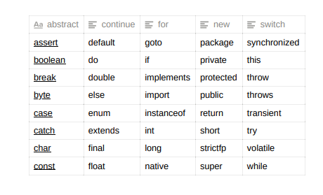

# Intro
Java
Oracle corporation
10 million developers world wide
3 billion users

Features - 
1. Simple
2. Object oriented
3. WORA - Write once run everywhere
4. Security - JVM
5. Very good memory management system
6. Very good exception handling mechanism
7. Java support Multithreaded 

Java comes in the form of 3 category
1. JSE/J2SE - Java 2 standard edition / Core Edition => to develop desktop apps
2. JEE/J2EE - Java 2 enterprise edition => for large apps
3. JME/J2ME - Java 2 micro edition => For mobile apps

* J2SE
    * It is an specification from Sun-microsystem
    * Implmentation of this J2SE specification is JDK s/w.
    * JDK 17 - Latest version



## Java application development
Ways to run the Java code
* Notepad and Command prompt
* IDE s/w (Integrated Development Environment)
    * IntelliJ IDEA - Community Edition
    * Eclipse
    * Netbeans etc

## Download IntelliJ Idea

Navigate Google
Type IntelliJ Idea
Go to Windows tab
Download Community 
Choose .exe file

## The basic steps to develop and execute a java application are - 
1. Compilation phase
2. Execution phase

X.java (source code) => java compiler => X.class file (It contains the byte code)

byte code is platform independent
And this byte code can be run on any platform (windows, Mac, Linux)

## Hello world program

```
package com.masai;
public class Main {
    public static void main(String[] args) {
       System.out.println("Hello World!");
        System.out.println("---------");
    }
}
```
