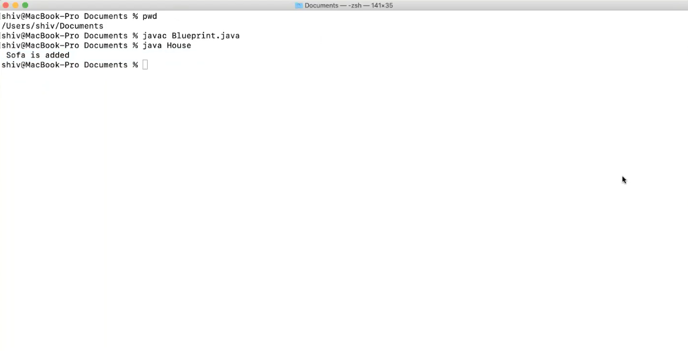
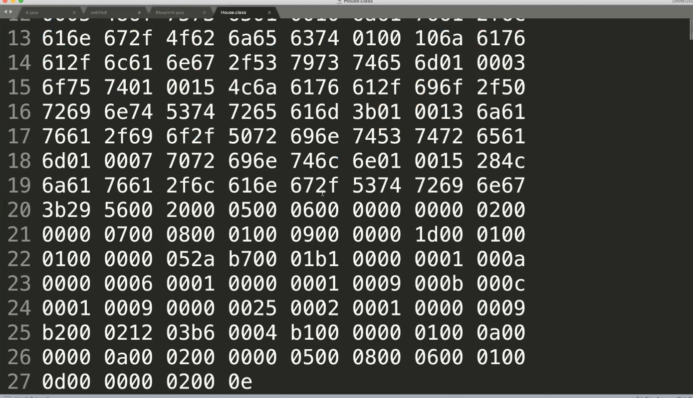
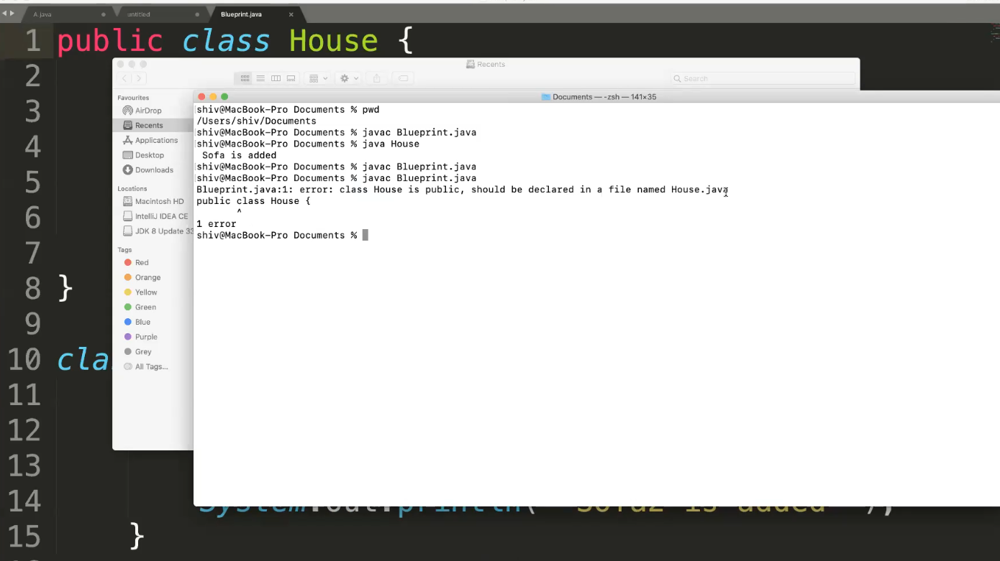

### How to run java program using CMD?
1. write a progam in notepad >> save it >> Navigate to file location >> open CMD here
Blueprint.java
```
class House{
    public static void main(String[] args){
        System.out.println("sofa added")
    }
}
```
2. javac <Filename.java> e.g. javac Blueprint.java
3. java <classname> e.g java House

  


Class file created by compiler



* If we add public keyword before class, then we have to also name the file same as class name


public is a access modifier

# How JVM Works ? (Refer Class Notes)
* JVM(Java Virtual Machine) acts as a run-time engine to run Java applications. JVM is the one that  
actually calls the main method present in a java code. JVM is a part of Runtime Environment).
* Java applications are called WORA (Write Once Run Anywhere). This means a programmer can develop  
Java code on one system and can expect it to run on any other Java-enabled system without any  
adjustment. This is all possible because of JVM.
* When we compile a .java file, .class files(contains byte-code) with the same class names present in .java •  
file are generated by the Java compiler. This .class file goes into various steps when we run it. These  
steps together describe the whole JVM.