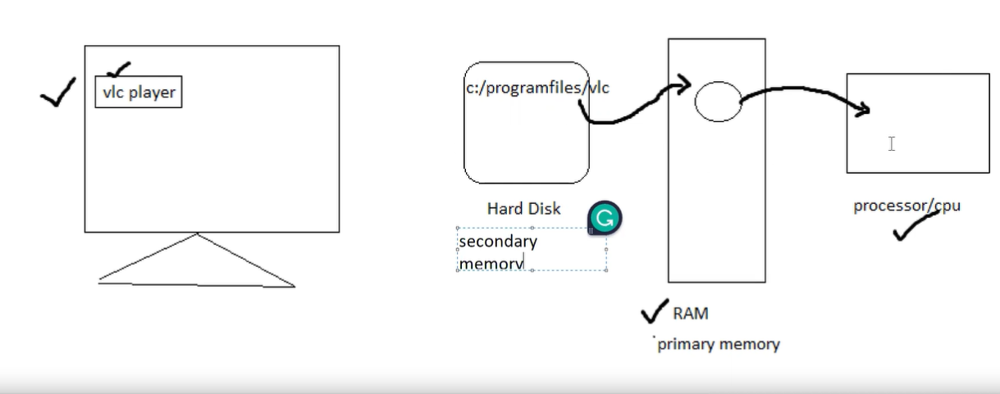

### How to run java program using CMD?
1. write a progam in notepad >> save it >> Navigate to file location >> open CMD here
Blueprint.java
```
class House{
    public static void main(String[] args){
        System.out.println("sofa added")
    }
}
```
2. javac <Filename.java> e.g. javac Blueprint.java
3. java <classname> e.g java House


Class file created by compiler


* If we add public keyword before class, then we have to also name the file same as class name
