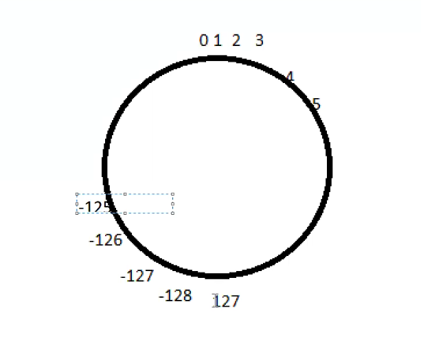

# Java Language Fundamentals

Java Naming Convention, coding standard.
* Java is a **case sensetive programming language**, we use diff conventions for naming our   
classes, methods and variables.  
* **All class names, abstract class names, interface names and Enum,** names should follow   
**"PascalNamingConvention"**, which means, the first letter of every word should be in upper case
    * Example: String, ArrayList, InputStreamReaderIStringBuffer,Student, Employee,etc
* **All Java variables, method names** should follow **camelNamingConvention**, which means the first   
letter should be in lowercase and the subsequent word should start with Uppercase

Example (variables): in, studentName, pageContext  
Example (methods): concat(), forName(), getInputStream(), calculatelnterest()  
* All java **Constant variables** must be provided in Upper Case letters.  
(constant variables are the variables, whose values are fixed throughout the program)  
Example: MIN_PRIORITY, MAX_PRIORITY, NORM_PRIORITY

* Java programming language belongs to C family programming language, i.e. most of basic   
programming constructs of Java are similar to the c language with some minor changes

Like :- operators, if-else, loops switch case, etc.

## Data Types
Before representing the data , first we have to confirm type of the data, by using data types  
in java there are 2 types of data types:-
l.primitive data types
2.user-defined data types

primitive data types:-
java supports total 8 primitive data types under 4 category:-  
1. Integers:-  
    * byte :- 8bit / 1 byte // 0 :- 127 to -128
    * Short - 16bit/2 byte // 0
    * int - 32 bit/4 byte// 0
    * long - 64 bit/8 byte// 0

2. Real numbers - 
    * float - 32 bit / 4 byte //0.0
    * double - 64 bit / 8 byte // 0.0

3. Character
    * char - 16bit or 2 byte(Unicode ) // ''

4. Boolean
    * 1 bit // true/false // false

*  Note - Any number with decimal point will be considered as double in java, not a float.

* Any non-decimal point digit is treated as int by default in java

## Type Casting
The procedure of converting one data type into its equivallent another data type is   
known as typecasting.

Note:- we can not typecast any datatype to any other data type, we can typecast only   
equivallent /compatible types.

--we have 2 types of typecasting:-
* Implicit typecasting :- (upcasting/ widening)
    * smaller datatype value into the bigger data type ex:- from int to long

int x=10;
long y=x;

2. Explicit typecasting (downcasting/narrowing)
    * Bigger datatype value into its equivalent smaller data type
    * e.g. into to byte
    * int x = 10;
      byte b = (byte)x; 



Example 1
```
class Demo 
{
	public static void main(String[] args) 
	{
		int x = 127;
		// Explicit Type Casting
		byte b = (byte)x;
		System.out.println(b);
	}
}
```
Example 2
```
class Demo{
    public static void main(String[] args){
        int x = 5000;
        byte b = (byte)x;
        System.out.println(b);
    }
}
```
Example 3
```
class Demo 
{
	public static void main(String[] args) 
	{
		//float f = (float)10.55;
		float f = 10.55f;

		System.out.println(f);
	}
}
```

Example 4
```
class Demo 
{
	public static void main(String[] args) 
	{
		byte b = 10;
		//byte c = b+1;
		// Result of above expression will be
		// an integer, so we need to typecast it
		byte c = (byte)(b+1);
		System.out.println(c);
		//formula
		//max(int, typeA,typeB,typeC)
		// Any non decimal number is integer
		// max(int,byte,int)
	}
}


```
doing b++ will not any error  
internal typecasting will happen


## User - Defined data types
* Here we can take class, interface, enum, etc as userdefined data types.
* Employee emp;
* int x;

## Wrapper classes
Since java is an Object-Oriented programming language, There are some situations,   
where we need to represent the primitive data types in the form of objects.  
--in **java.lang** package some classes are defined to represent the primitive   
datatypes in the form of object. 
these classes are known as wrapper classes  

Ex:-  
byte : java.lang.Byte  
short: java.lang.Short  
int : java.lang.Integer  
long : java.lang.Long  
float:  java.lang.Float  
char : java.lang.Character  
boolean : java.lang.Boolean  

String s = "100";

To identify the range of a perticular data type these wrapper classes  
has provided following constant variables in all the wrapper classes   
except Boolean class.
MIN_VALUE  
MAX_VALUE  

`System.out.println(Byte.MIN VALUE+-"+Byte.MAX_VALUE);`