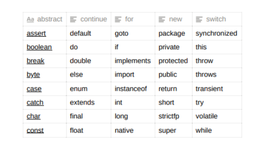

# lectures - 29948

```java
package org.sdet;

public class Blueprint {
    // This is where execution starts
    public static void main(String[] args){
        
        /*
        Naming - Pascal
        For class name , For interface name
        e.g. MyClassName, MyInterfaceName

        Camelcase
        myVariableName
        myMethodName

        Invalid
        #myname
        1myVariable
        my-variable
         */
    }
}

```

## Java Language Fundamentals

1. Identifiers
2. Literals
3. Keywords/Reserved words
4. Operators

## Identifiers

The identifier is a name assigned to the programming elements like variables, methods,
classes, abstract classes, interfaces etc.

```java
int age = 25; int height; // default to be 0
height = 67;

here
int : data type
age : variable [identifier]
= : operator (assingment)
25 : value/constant [literal]
; : terminator
```

Note - To Provide identifiers in java programming, we have to use the following rules and regulations -

Identifiers should not be started with any number, identifiers may be started with an alphabet, '_'
symbol, '$' symbol, but, the subsequent symbols may be a number, an alphabet, '_' symbol, '$' symbol.

```java
// camelCase(recommendation, convention) = thisIsMe => variable names, Method names

// PascalCase = ThisIsMe => classes, interfaces, abstract classes

Identifiers are not allowing spaces in the middle.

ex : 
int employeeNumber = 111; //valid
String #address = "Pune"; // Invalid
String employee-Address = "Hyderabad"; //Invalid
getInputStream();//valid
get Input Stream(); // Invalid

In java applications, it is suggestible to provide identifiers with a particular meaning.
```

## Literals

Literal is a constant/value assigned to the variable.

To prepare java programs, JAVA has provided the following set of literal :

1. Integer/Integral Literals -
byte, short, int, long - 10, 20, 30, ....
char - 'A', 'B', ...

2. Floating Point Literals -
float - 10.22f, 23.345f, ...
double - 11.123, 456.345, ...

3. Boolean Literals -
boolean - true, false

4. String Literals -
String - "Welcome", "Hello", ....

## Keywords/Reserved Words

Keywords in Java convey a special meaning to the compiler therefore, these cannot be used as
identifiers.
Among the list of keywords list mentioned below the keywords goto and const are currently not in use.
They are reserved words (for future use)..



## Operators

An operator is a symbol, it will perform a particular operation over the provided operands.
To prepare java applications, JAVA has provided the following list of operators.

1. Arithmetic Operators
+, - , * ,/ , %, ++, --

2. Assignment Operators
=, +=, -=, *=, /=, %=

3. Comparison Operators
==, !=, < , >, <=, >=

4. Boolean Logical Operators
5. Bitwise Logical Operators
6. Short-Circuit Operators
7. Ternary Operator

Example1 - 
```java
package com.masai;
public class Main{
    public static void main(String[] args){
        int a=10;
        System.out.println(a); //10
        System.out.println(a++);//10 //post-increment => (print, increase)
        System.out.println(++a);//12
        System.out.println(a--);//12
        System.out.println(--a);//10
        System.out.println(a);//10
    }
}
```

Outpus - 
10
10
12
12
10
10


