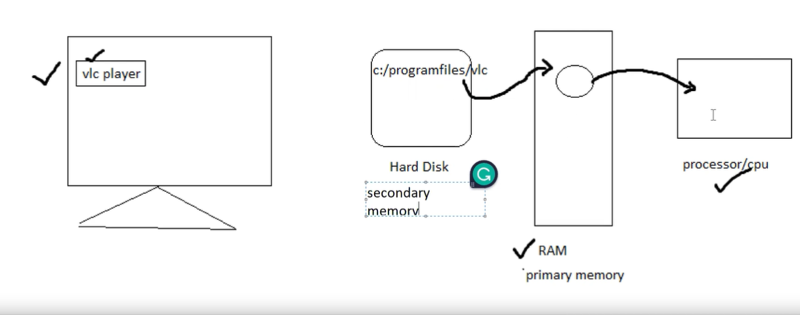
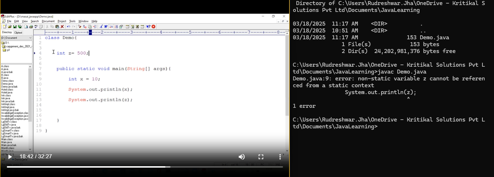
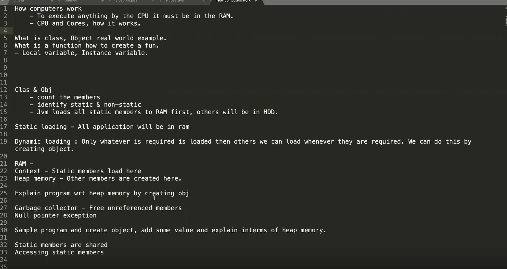
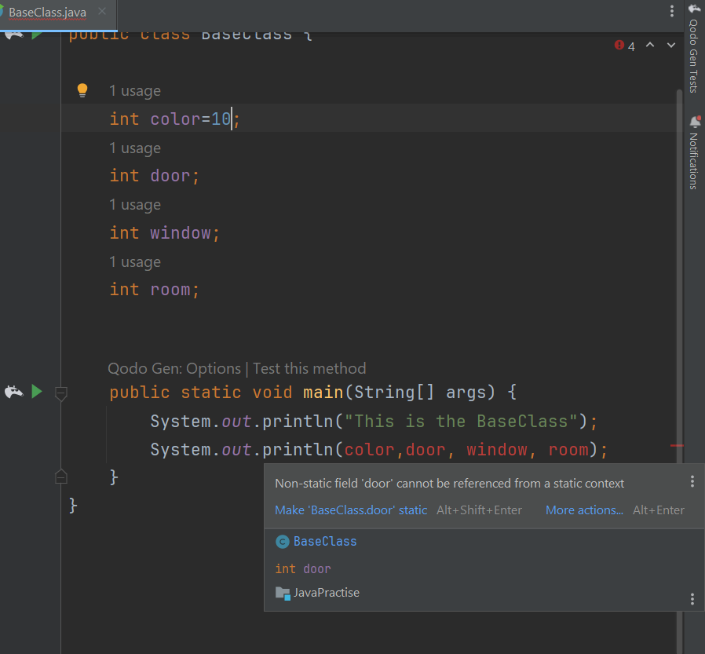

# Java OOPs concept

Procedural programming is about writing rocedures or functions that erformo erations on the data, while object-  
oriented programing is about creating objects that contain both data and methods(operations).  

--In Object Oriented programming approach,we need to find the programming solution in the term of objects.  
--Objects are the real-world entities which can have some state and some behaviour. example pen, table,watch,computer,etc. objects can be physical or logical.  

Classes and objects are the two main aspects of object-oriented programming.

Class is a blueprint of an object. we can create multiple objects to a perticular class.

whereas an object can be defined as an instance of a class. An object have an address and occupies some space in the memory.

Car class : can have multiple objects like :- Creta, Scorpio, Safari  
Each object can have its own state and their behaviour.  
**State of an object:-** data which is present to the object is known as state of an object  
**Behaviour of an object:-** methods which are applicabe to the object is known the behaviour of an object.  
example:-
Each car object can have thier own state like:-  
model  
color  
price  

and behaviour like:-  
start()  
stop()  
changeGear()  

In Object-Oriented programming, multiple objects will collaborate with each other and provide the solution for a perticular problem.  

Object-Orineted programming concept provides following principle to the application development and application maintenance:-  

Encapsulation
Polymorphism
Inheritance
Abstraction

**Static loading:-** a block of code would be loaded into the RAM before it is executed,(after being loaded into the RAM, it may or may not execute).  

**dynamic loading:-** a block of code would be loaded into the RAM, only when it is required to be executed.
Note:- c program follows static loading, where as java follows dynamic loading.

IPO model :- input , process , output


**vlc player:**  
harddisk
c:\program files\vlc



**C application -**  
Explain - 
100 variables  
1000 functions  
1 function  

**Java applicaiton -** 
Demo.java => source code

To create/compile the class file use - `javac Demo.java`
To run the above file (byte code will be created) use - `java Demo`

Demo.class => byte code

all the static variables, methods will be loaded 




* Class file contains the byte code

Q. Explain the working of a Java program with respect to harddisk, RAM, Class file, Byte code. Which part is loaded and runs  and how.

* Java doesn't support nested methods

* What is the requirement of creating an Object?
* To load the non static member of a class dynamically into the RAM we need to create the object.


Q. What is the responsibility of "new" operator?
1.reserve the memory space inside the heap area of RAM.  
2. Load all the non-static members of that class into this area
3. While loading the non-static variables, if that variable is not initialized, then default initialization will be provided by the new operator





* nonstatic cannot be accessed from static method
  
  


```
public class BaseClass {
    static int a = 10;
    int b;

    static public int add(int x, int y){
        return x+y;
    }

    int multiply(int x, int y){
        return x*y;
    }


    public static void main(String[] args) {
        int c = add(10,20);
        System.out.println(c);

        BaseClass b1 = new BaseClass();

        int d = b1.multiply(30,40);
        System.out.println(d);
    }
}
```


* Static members will be common for all the objects
* Non-static members can have different copy

```java
public class Bank {

    // Bank Class is blueprint

    static int totalBankBalance = 0;
    int userAccountBalance=0;
    long userAccountNumber=0;
    String name;
    long userMobileNumber=0;

    public void createUserAccount(int a, long b, long c, String d){
        userAccountBalance = a;
        userAccountNumber = b;
        userMobileNumber = c;
        name = d;
    }

    public void displayUserAccountDetails(){
//        System.out.print(userAccountBalance);
//        System.out.print(userAccountNumber);
//        System.out.print(userMobileNumber);
//        System.out.print(name);

        System.out.println(name + " " + userAccountBalance + " " + userAccountNumber + " " + userMobileNumber);
    }

    // All money in HDFC bank
    void displayEntireHDFCBankBalance(){
        System.out.println(totalBankBalance);
    }

    public static void main(String[] args){
        Bank newCustomerRudreshwar = new Bank();
        newCustomerRudreshwar.createUserAccount(35000,50100238567891L
                ,1406537079L, "Rudreshwar Jha");

        newCustomerRudreshwar.totalBankBalance = 1000;


        Bank newCustomerRaja = new Bank();
        newCustomerRaja.createUserAccount(40000, 50100234667891L, 1406657078L,"Raja Deoraj"
        );
        newCustomerRaja.totalBankBalance = 2000;

        newCustomerRudreshwar.displayUserAccountDetails();
        newCustomerRaja.displayUserAccountDetails();

        newCustomerRudreshwar.displayEntireHDFCBankBalance();
        newCustomerRaja.displayEntireHDFCBankBalance();


        ;

    }
}
```


## Summary
* Static, non static member
* RAM - Context and Heap memory
* Debug in Intellij
* "new" keyword
* Garbage collector
* Null Pointer exception
  * Crashing
