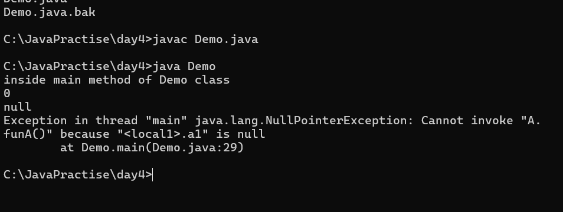

# Java Day4 Pre Class Video: Object Collaboration

In an Object Oriented Programming language like Java, multiple classes collaborate with each other and provide the  
services(solution to a perticular problem).
--the classes which will try to collaborate each other, should be in **same path.**  
--we can define a class as a instance member of another class as well , by this we establish "Has-A" relationship between 2
objects.  


* Default value of any reference value is null

Keep both files in same path
```java
class  A
{
	int i = 10;
	void funA(){
		System.out.println("inside function of A");
		
	}
}

```


```java
//package day4;

public class Demo {

	/* int x = 100;
	A a1 = new A(); */

	int x;
	A a1;

    public static void main(String[] args) {
        System.out.println("inside main method of Demo class");


/*		Demo d1 = new Demo();
		
		// creating object of different class here
		// it is possible condition is both class should be in the same path

		A a1 = new A();

		System.out.println(d1);
		System.out.println(a1); */
		
		Demo d1 = new Demo();
		System.out.println(d1.x);
		System.out.println(d1.a1);

		//d1.a1.funA();

    }
}
```

* NullPointerException - It happens when we try to access a member from a null value

```java
//package day4;

public class Demo {

	/* int x = 100;
	A a1 = new A(); */

	int x;
	A a1;

    public static void main(String[] args) {
        System.out.println("inside main method of Demo class");


/*		Demo d1 = new Demo();
		
		// creating object of different class here
		// it is possible condition is both class should be in the same path

		A a1 = new A();

		System.out.println(d1);
		System.out.println(a1); */
		
		Demo d1 = new Demo();
		System.out.println(d1.x);//0
		System.out.println(d1.a1);// null

// a1 is holding null value
		d1.a1.funA();

    }
}
```



