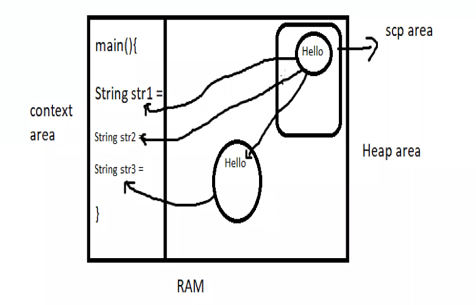

# String class

* In java String is an obj that represents a sequece of character

* String - java.lang

## How to create

String str1 = "Welcome to java"; => **String Literal**

char[] str = {'S','P', 'A'} => **String Array**

```
class  String1
{
	public static void main(String[] args) 
	{
		// Shortcut way
		String str1 = "Welcome to Java";
		System.out.println(str1);

		// By using new operator
		String str2 = new String("Welcome to Java"); => String object
		System.out.println(str2);

		// What's the difference
	}
}
```


```java
package day4;

public class StringPractise {

    public static void main(String[] args){
        String str1 = "Welcome to Java";
        String str2 = "Welcome to Java";

        String str3 = new String("Welcome to Java");
        System.out.println(str1==str2);// true
        System.out.println(str1==str3);// false
    }

}
```

## String Pool
What does that mean?
String Pool is a storage area in JAVA Heap where only string literals stores.
also known as String Intern Pool or String Constant Pool.
String Caching
Reusable Strings
The distinctvalues are stored.





The image represents memory allocation in Java for `String` objects. It differentiates between the **String Constant Pool (SCP)** and the **Heap Area** in RAM.

### Explanation with your code:

```java
public class StringPractise {
    public static void main(String[] args) {
        String str1 = "Welcome to Java";
        String str2 = "Welcome to Java";
        String str3 = new String("Welcome to Java");

        System.out.println(str1 == str2); // true
        System.out.println(str1 == str3); // false
    }
}
```

### Memory Breakdown:
1. **String Constant Pool (SCP) - Inside Heap Area**
   - When `String str1 = "Welcome to Java";` is executed:
     - The literal `"Welcome to Java"` is stored in the **String Constant Pool (SCP)**.
     - `str1` refers to this object in the SCP.
   - When `String str2 = "Welcome to Java";` is executed:
     - Since `"Welcome to Java"` already exists in the SCP, `str2` points to the same memory location.
   - Hence, `str1 == str2` returns **true**, as both reference the same SCP object.

2. **Heap Area - New String Object**
   - When `String str3 = new String("Welcome to Java");` is executed:
     - A **new object** is explicitly created in the **Heap Memory** (outside the SCP).
     - `str3` refers to this new object.
   - This is why `str1 == str3` returns **false**, as they refer to **different objects** in memory.

### Image Correlation:
- The **SCP area** in the image contains the `"Hello"` string (analogous to `"Welcome to Java"` in your code).
- `str1` and `str2` both point to this SCP object.
- The **Heap area** contains a separate `"Hello"` object (analogous to `str3` in your code).
- `str3` points to this separate heap memory object.

### Key Takeaways:
- **String literals** are stored in the **SCP**, and duplicate literals refer to the same object.
- **Explicit `new String("value")` creates a new object in the Heap**, even if the same string exists in SCP.
- `==` checks **reference equality** (whether two references point to the same object).
- To compare actual string values, use `.equals()` instead of `==`. 

### **String Immutability in Java**
In Java, **Strings are immutable**, meaning their values **cannot be changed** after creation. This is achieved by declaring the `String` class as `final`, and its internal character array (`char[] value`) is also `final`, preventing modifications.

#### **Why are Strings Immutable?**
1. **String Pool Optimization (SCP)**  
   - Java uses a **String Constant Pool (SCP)** to store string literals.
   - If two variables reference the same string literal, they share the same memory location.
   - If strings were mutable, changing one would affect all references, leading to **unexpected behavior**.
  
2. **Security**  
   - Strings are commonly used in **user authentication, file paths, and network connections**.  
   - If a String were mutable, a hacker could modify sensitive information like database credentials.
  
3. **Thread-Safety**  
   - Since Strings are immutable, multiple threads can safely share them without worrying about **synchronization**.
  
4. **Caching & Performance**  
   - Java caches hash codes for Strings, so they don’t need to be recomputed multiple times.  
   - If Strings were mutable, their hash codes would change, making them **inefficient in HashMaps and Sets**.

---

### **Example of String Immutability**
```java
public class StringImmutableTest {
    public static void main(String[] args) {
        String str1 = "Hello";
        str1.concat(" World"); // This does NOT modify str1

        System.out.println(str1); // Output: Hello
    }
}
```
**Why didn't `str1` change?**  
- The `concat()` method **creates a new string** (`"Hello World"`) instead of modifying `str1`.  
- Since `str1` is immutable, it **still refers to `"Hello"`**.

To actually modify the value, we need to assign it:
```java
str1 = str1.concat(" World");
System.out.println(str1); // Output: Hello World
```

---

### **Mutable Alternative: StringBuilder**
If you need a **mutable** string, use `StringBuilder`:
```java
StringBuilder sb = new StringBuilder("Hello");
sb.append(" World"); // Modifies the same object
System.out.println(sb); // Output: Hello World
```
- `StringBuilder` allows modifications without creating new objects.
- It is more **efficient for frequent string manipulations**.

---

### **Conclusion**
- **String is immutable** for performance, security, and thread-safety.
- **SCP optimizes memory** by reusing literals.
- Use **`StringBuilder` or `StringBuffer`** when modifying strings frequently.


## Array

example
```
class  Array1
{
	public static void main(String[] args) 
	{
		int[] marks = new int[10];

		System.out.println(marks);
	}
}
```

An **ArrayIndexOutOfBoundsException** occurs in Java when you try to access an index of an array that is either negative or greater than or equal to the array's length.  

### **Example of ArrayIndexOutOfBoundsException**
```java
public class ArrayExample {
    public static void main(String[] args) {
        int[] numbers = {1, 2, 3, 4, 5}; 
        
        // Trying to access an invalid index
        System.out.println(numbers[5]); // Index 5 is out of bounds (Valid indices: 0 to 4)
    }
}
```
### **Output**
```
Exception in thread "main" java.lang.ArrayIndexOutOfBoundsException: 5
```

---

### **Causes of ArrayIndexOutOfBoundsException**
1. **Accessing an index that does not exist**  
   ```java
   int[] arr = new int[5];
   System.out.println(arr[5]); // Error: Index 5 is out of bounds
   ```
   
2. **Negative Index**  
   ```java
   int[] arr = {10, 20, 30};
   System.out.println(arr[-1]); // Error: Negative indices are not allowed
   ```
   
3. **Looping Beyond Array Limits**
   ```java
   int[] arr = {1, 2, 3};
   for (int i = 0; i <= arr.length; i++) { // 'i <= arr.length' causes out of bounds
       System.out.println(arr[i]); 
   }
   ```

---

### **How to Prevent ArrayIndexOutOfBoundsException**
1. **Check array boundaries before accessing elements**
   ```java
   if (index >= 0 && index < arr.length) {
       System.out.println(arr[index]);
   } else {
       System.out.println("Index out of bounds!");
   }
   ```
   
2. **Use `arr.length` in loops**
   ```java
   for (int i = 0; i < arr.length; i++) { // Use '<' instead of '<='
       System.out.println(arr[i]);
   }
   ```

3. **Use Enhanced For Loop (Recommended)**
   ```java
   for (int num : arr) {
       System.out.println(num);
   }
   ```


