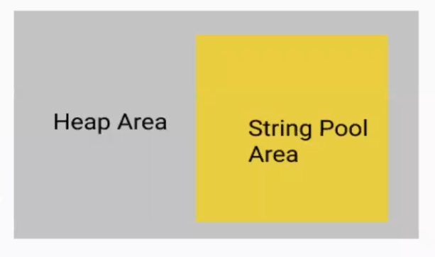
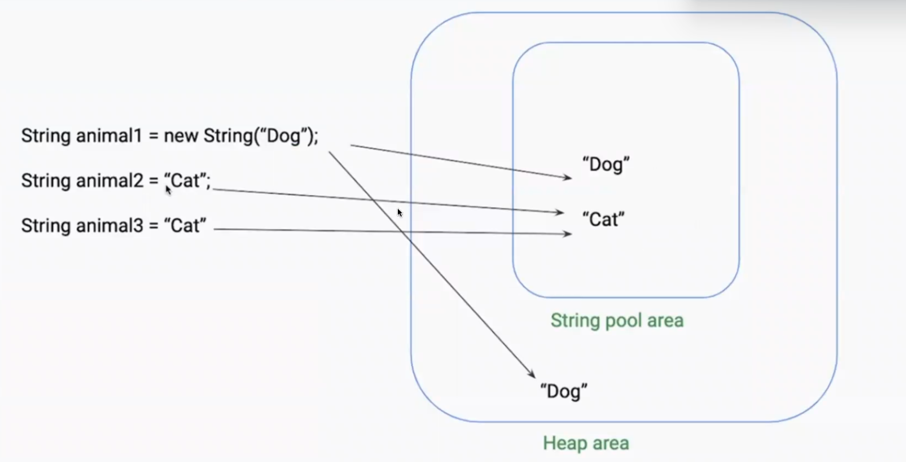

# String - L

String is basically an object that represents sequence of char values. OR An array of characters.

## String Pool

* It is just like a CARPOOL. Like String are stored in a box

What does that means?

* String Pool is a storage area in Java Heap where only string literals stores.
* Also known as **String Intern Pool** or **String Constant Pool**
  * **String Caching**
  * **Reusable Strings**
  * The **distinc**t values are stored.

* Strings are Immutable. That means Strings cannot be changed.
  * But it can be changed with other way


```java
package day4;

public class StringPractise {

    public static void main(String[] args){
        String str1 = "Cat";
        String str2 = "Cat";

		System.out.println(str1==str2);// true
    }

}
```

## Benefits

* Increase the performance
* Decrease the memory load.
* To decrease the number of String objects.





## String Builder and String Buffer

* Both used to create the Strings
* Both StringBuilder and StringBuffer are mutable
* Both are exactly same.

e.g.  
`StringBuffer stringBuffer = new StringBuffer("spartans");`  

`StringBuilder stringBuilder = new StringBuilder("spartans");`

### StringBuffer

* Thread Safe
  * All methods are synchronized in StringBuffer.
  * Only one thread is allowed to operate to it.
  * Next thread has to wait until previous thread complete its task.

### StringBuilder

* Not Thread Safe
  * All ...

### String vs StringBuilder vs StringBuffer

Parameter - Storage, Mutability, Thread Safe, Performance, Syntax


| Parameter      | String                         | StringBuilder                  | StringBuffer                    |
|--------------|--------------------------------|--------------------------------|--------------------------------|
| **Storage**   | Stored in the **String Pool** (if created using literals) or **Heap Memory** (if created using `new`). | Stored in **Heap Memory**.    | Stored in **Heap Memory**.    |
| **Mutability** | **Immutable** (Once created, cannot be changed). | **Mutable** (Can be modified without creating a new object). | **Mutable** (Can be modified without creating a new object). |
| **Thread Safe** | **Thread-Safe** (Since it's immutable, it can be shared across multiple threads without issues). | **Not Thread-Safe** (Multiple threads may cause inconsistency). | **Thread-Safe** (Uses synchronized methods to ensure safe usage in multi-threaded environments). |
| **Performance** | **Slow** (Every modification creates a new object, increasing memory usage). | **Fast** (Better performance than `String` and `StringBuffer` since it's not synchronized). | **Slower than `StringBuilder`** (Due to synchronization overhead). |
| **Syntax** | `String str = "Hello";` <br> `str = str + " World";` | `StringBuilder sb = new StringBuilder("Hello");` <br> `sb.append(" World");` | `StringBuffer sbf = new StringBuffer("Hello");` <br> `sbf.append(" World");` |

**Key Takeaways:**  
- Use **String** when you need **constant/unchangeable values**.  
- Use **StringBuilder** for **faster string manipulations in a single-threaded environment**.  
- Use **StringBuffer** when **thread safety** is required but performance is still a concern.  


* Example

```java
class Gmail 
{
	public static void main(String[] args) 
	{
		String name = "Shiv";
		String name2 = new String("Shiv");

		System.out.println(name);
		System.out.println(name2);

		if(name == name2){
			System.out.println("both are same");
		}
		else{
			System.out.println("both are different");
		}

    //example - 
    byte[] bytes = {100,102,103};
		String str1 = new String(bytes);
		System.out.println(str1);

    // example - 
    char chars1[] = {'r', 'u', 'd', 'r', 'a'};
		String s = new String(chars1);
		System.out.println(s);

    // StringBuilder
    StringBuilder s1 = new StringBuilder("ai");
		System.out.println(s1);


	}
}
```

## operations on strings

1. int length()
2. Char charAt(int i)
3. String substring(int i)
4. String substring(int i, int j)
5. String concat(String str)
6. int indexOf(String s)


