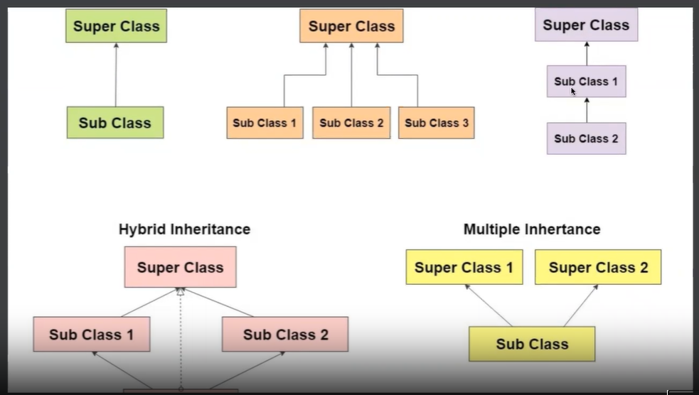

# Inheritance
In Java, inheritance is one of the core concepts of Object-Oriented Programming (OOP). It allows a new class (called a subclass or child class) to acquire (or inherit) the fields (variables) and methods of an existing class (called a superclass or parent class).

In simple words:
Inheritance lets you create a new class based on an existing class, reusing code, and adding new features or modifying existing ones without rewriting the original code.

**Types of Inheritance in Java:**
Single Inheritance: One class inherits from another.

Multilevel Inheritance: A class inherits from a class which is itself a subclass.

Hierarchical Inheritance: Multiple classes inherit from a single parent class.

(Java does not support multiple inheritance with classes to avoid ambiguity; instead, it supports multiple inheritance through interfaces.)



Example - Multilevel Inheritance
Father.java
```java
class Father 
{
	String skinTone = "Brown";
	void drinks(){
		System.out.println("I like water")
	}	
}
```
SonClass.java
```java
public class SonClass extends Father
{
	String = "Shiv";

	void greet(){
		System.out.println("greet")
	}

	public static void main(String[] args) 
	{
		SonClass obj = new SonClass();
		obj.greet();

		obj.drinks();
	}
}
```

GrandSon.java
```java
class GrandSon extends SonClass
{
	public static void main(String[] args) 
	{
		GrandSon grandSon = new GrandSon();

		grandSon.drinks();
	}
}
```
